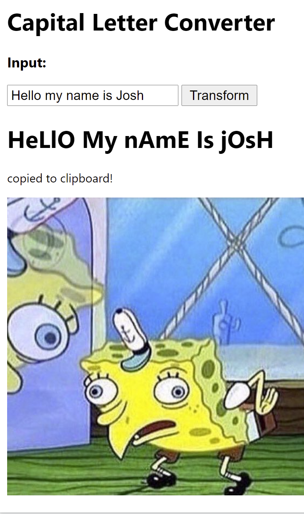

# upperCaseLetterTransformation
This project is an extension you can upload to your browser. 
When you click on the extension, a form will appear that can take in any text that you input.
When you submit the button, a text will appear that will capitalize every other character.

Here is a demonstration:

